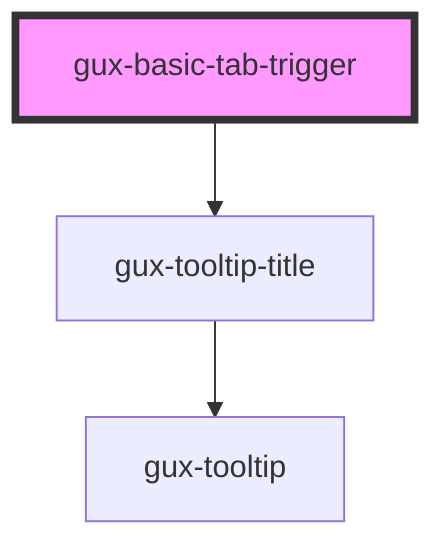

# gux-tabs-list

<!-- Auto Generated Below -->

## Properties

| Property      | Attribute       | Description | Type     | Default     |
| ------------- | --------------- | ----------- | -------- | ----------- |
| `panelId`     | `panel-id`      |             | `string` | `undefined` |
| `tabIconName` | `tab-icon-name` |             | `string` | `undefined` |
| `tooltip`     | `tooltip`       |             | `string` | `''`        |
| `triggerId`   | `trigger-id`    |             | `string` | `undefined` |

## Events

| Event                      | Description | Type                  |
| -------------------------- | ----------- | --------------------- |
| `internalactivatetabpanel` |             | `CustomEvent<string>` |

## Methods

### `guxFocus() => Promise<void>`

#### Returns

Type: `Promise<void>`

### `guxSetActive(active: boolean) => Promise<void>`

#### Returns

Type: `Promise<void>`

## Dependencies

### Depends on

- [gux-tooltip-title](../../gux-tooltip-title)

### Graph

----------------------------------------------

*Built with [StencilJS](https://stenciljs.com/)*
