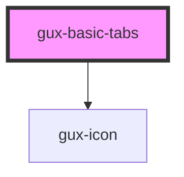

# gux-tabs

<!-- Auto Generated Below -->

## Properties

| Property      | Attribute     | Description             | Type                                | Default        |
| ------------- | ------------- | ----------------------- | ----------------------------------- | -------------- |
| `alignment`   | `alignment`   | Tab alignment           | `"center" \| "fullWidth" \| "left"` | `'left'`       |
| `orientation` | `orientation` | Tab orientation         | `"horizontal" \| "vertical"`        | `'horizontal'` |
| `value`       | `value`       | tabId of the active tab | `string`                            | `''`           |

## Events

| Event   | Description                    | Type               |
| ------- | ------------------------------ | ------------------ |
| `input` | Triggers when a tab is active. | `CustomEvent<any>` |

## Dependencies

### Depends on

- [gux-icon](../../stable/gux-icon)

### Graph

----------------------------------------------

*Built with [StencilJS](https://stenciljs.com/)*
