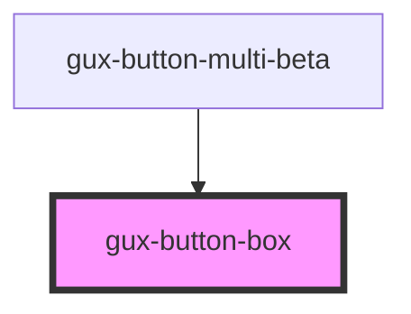

# gux-list

A list element. In order to use this element list contents must be slotted in.

Example usage

```html
<gux-list>
  <gux-listbox-item value="test" text="test1" />
  <gux-listbox-divider />
  <gux-listbox-item value="test" text="test2" />
  <gux-listbox-item value="test" text="test3" />
</gux-list>
```

Example with slotting

```html
<gux-list>
  <gux-listbox-item
    ><span>⌘</span><gux-text-highlight text="test"
  /></gux-listbox-item>
</gux-list>
```

<!-- Auto Generated Below -->


## Slots

| Slot | Description               |
| ---- | ------------------------- |
|      | collection of gux-buttons |


## Dependencies

### Used by

 - [gux-button-multi-beta](..)

### Graph


----------------------------------------------

*Built with [StencilJS](https://stenciljs.com/)*
