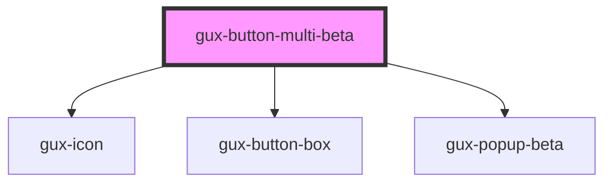

# gux-button-multi
<!-- Auto Generated Below -->

## Properties

| Property   | Attribute  | Description | Type      | Default |
| ---------- | ---------- | ----------- | --------- | ------- |
| `disabled` | `disabled` |             | `boolean` | `false` |

## Slots

| Slot           | Description                |
| -------------- | -------------------------- |
| `"button-box"` | for gux-button-box element |
| `"label"`      | for label element          |

## Dependencies

### Depends on

- [gux-icon](../../stable/gux-icon)
- [gux-button-box](gux-button-box)
- [gux-popup-beta](../gux-popup)

### Graph

----------------------------------------------

*Built with [StencilJS](https://stenciljs.com/)*
